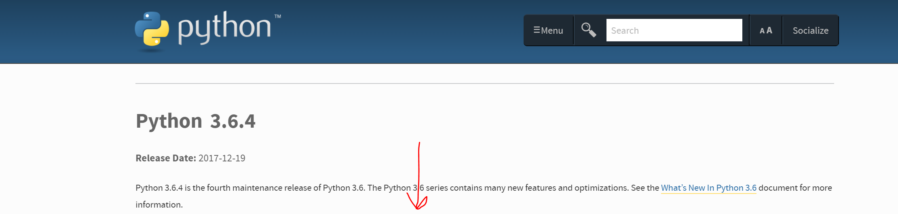
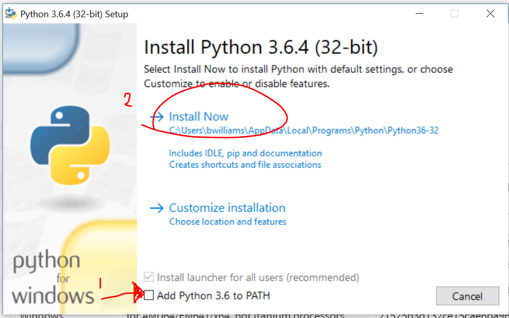

# OnTime
Triple P's (Perplexed Pixelated Pythons) Project to create an app to help you stay On Time to your appointments

Group Members: Ben Williams, Kelly Costner, Chris "Waffles" Lloyd

https://belobig.github.io/OnTime/

Concept: Never be late with On-Time; all-in-one event calendar, map directions, and scheduler. Add your events to the schedule table. View the events already created in the database. See the map and directions of the next event or an event from the table. All you need is a Google login to be On-Time.

Motivation:

Design Process:

Technologies:
- Python (for testing Auth. locally)
How to setup for your self:
1. Go to Python.org

2. 'Click here' 

3. Scroll down to see downloads section

4. Select your exe version (32 bit or 64 bit)

5. 
6. Make sure to select PATH check box, unneed for MAC.

7. 
8. 

- Firebase v4.10.1
- Many... Google APIs 

- Bootstrap v3.3.7 (css, js, etc)
- JQuery v3.3.1
- Moment.js (for manipulation of time elements)
- 

Future Developements:
- Use Google Calendar instead of database

- Prompt to change 'how early' to the event
